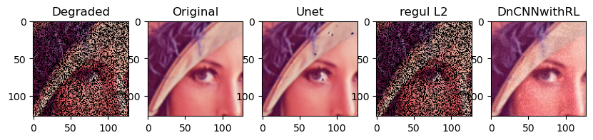
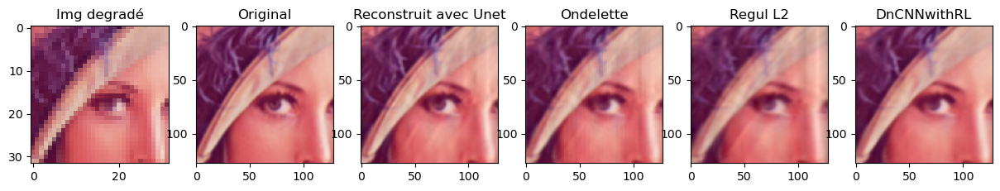
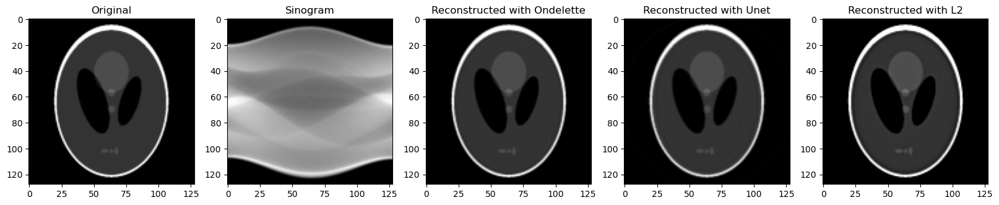

# Plug and play project

## Problèmes Inverses et Méthodes Plug-and-Play

### Problème Inverse

Les problèmes inverses sont des défis courants en traitement d'images où
l'objectif est de reconstruire une image originale à partir de ses
observations dégradées. Par exemple, il s'agit de récupérer une photo
nette à partir d'une version floue ou de restaurer des parties
manquantes d'une image.

Mathématiquement, cela peut être exprimé par :

$$
\mathbf{y} = \mathbf{A} \mathbf{x} + \mathbf{n},
$$

où :

-   $\mathbf{y}$ est l'image observée, souvent dégradée.
-   $\mathbf{A}$ représente l'opération qui a dégradé l'image originale
    (comme le flou, la réduction de résolution, etc.).
-   $\mathbf{x}$ est l'image originale que nous cherchons à
    reconstruire.
-   $\mathbf{n}$ est le bruit ajouté lors de l'observation.

### Formulation du Problème

Pour résoudre un problème inverse, nous voulons trouver une image
$\mathbf{x}$ qui soit compatible avec les observations $\mathbf{y}$ tout
en respectant certaines propriétés désirées (comme la netteté ou la
régularité). Cela peut être formulé comme un problème d'optimisation :

$$
\min_{\mathbf{x}} \frac{1}{2} \|\mathbf{y} - \mathbf{A} \mathbf{x}\|^2_2 + \lambda R(\mathbf{x}),
$$

où :

-   $\frac{1}{2} \|\mathbf{y} - \mathbf{A} \mathbf{x}\|^2_2$ est le
    terme de fidélité aux données, assurant que notre estimation
    $\mathbf{x}$ est proche de l'observation $\mathbf{y}$.
-   $R(\mathbf{x})$ est un terme de régularisation qui impose des
    contraintes supplémentaires sur $\mathbf{x}$ pour obtenir une
    solution réaliste.
-   $\lambda$ est un paramètre qui équilibre l'importance de la fidélité
    aux données et de la régularisation.

### Méthodes Plug-and-Play

Les méthodes Plug-and-Play (PnP) sont une solution flexible et puissante
pour résoudre les problèmes inverses. Plutôt que de définir
explicitement le terme de régularisation $R(\mathbf{x})$, les méthodes
PnP utilisent des débruiteurs avancés comme régularisateurs implicites.
Ces débruiteurs peuvent être des réseaux de neurones préentraînés ou
d'autres modèles sophistiqués.

#### Utilisation de la Descente de Gradient

La descente de gradient est une méthode populaire pour résoudre des
problèmes inverses en utilisant des techniques Plug-and-Play. Voici
comment cela peut être appliqué :

1.  **Formulation du problème** : Nous cherchons à minimiser une
    fonction de coût composée d'un terme de fidélité aux données et d'un
    terme de régularisation implicite.

2.  **Algorithme de descente de gradient avec débruitage** :
    L'algorithme de descente de gradient est modifié pour intégrer un
    débruiteur dans chaque itération. La mise à jour de l'estimation
    $\mathbf{x}$ se fait en deux étapes :

    **Mise à jour par descente de gradient** :
    $\mathbf{x}_{k+1} = \mathbf{x}_k - \alpha \nabla_{\mathbf{x}} ( \frac{1}{2} \|\mathbf{y} - \mathbf{A} \mathbf{x}_k\|^2_2)$, 
    où $\alpha$ est le pas de la descente de gradient et $\nabla_{\mathbf{x}}$ est le gradient de la fonction de coût par rapport à $\mathbf{x}$.

    **Débruitage Plug-and-Play** :
    $\mathbf{x}_{k+1} = \tau (x_{k+1} - D_{\sigma}(\mathbf{x}_{k+1})),$
    où $D_{\sigma}$ est le débruiteur utilisé comme modèle de
    régularisation implicite et $\tau$ le poids de régularisation.

3.  **Itération** : Ces étapes sont répétées jusqu'à convergence,
    c'est-à-dire jusqu'à ce que la différence entre deux itérations
    successives soit suffisamment petite.

#### Utilisation de l'Algorithme ADMM

L'algorithme ADMM (Alternating Direction Method of Multipliers) est
souvent utilisé avec les méthodes PnP pour résoudre des problèmes
inverses. Voici comment cela fonctionne :

1.  **Formulation du problème** : Nous cherchons à minimiser une
    fonction de coût composée d'un terme de fidélité aux données et d'un
    terme de régularisation implicite, qui peut être décomposée en deux
    sous-problèmes via des fonctions $f$ et $h$ :
    $\min f({x}) + \lambda h({x})$

2.  **Algorithme ADMM avec opérateurs de proximité** : L'algorithme ADMM
    est modifié pour intégrer des opérateurs de proximité qui gèrent les
    termes de régularisation et de fidélité aux données. La mise à jour
    de l'estimation se fait en trois étapes :

    -   **Mise à jour de** $x$ : $x_{k+1} = \text{prox}_f(v_k - u_k)$
        où $\text{prox}_f$ est l'opérateur de proximité associé à la
        fonction $f$, minimisant la somme de $f(x)$ et d'un terme
        quadratique qui lie $x$ à $v^k - u^k$.

    -   **Mise à jour de** $v$ : $v_{k+1} = \text{prox}_h(x_{k+1} + u_k)$
        où $\text{prox}_h$ gère la fonction $h$ et vise à régulariser
        $x_{k+1}$ en ajoutant la contribution de $u_k$, en minimisant
        $h(v)$ avec un terme quadratique reliant $v$ à $x_{k+1} + u_k$.

    -   **Mise à jour de** $u$ : 
        $$u_{k+1} = u_k + (x_{k+1} - v_{k+1})$$
        Cette mise à jour ajuste les multiplicateurs de Lagrange pour
        refléter l'écart entre $x_{k+1}$ et $v_{k+1}$, aidant à la
        convergence de l'algorithme vers une solution qui respecte à la
        fois $f$ et $h$.

3.  **Débruitage Plug-and-Play** : L'opérateur $\text{prox}_h$ est
    remplacé par un débruiteur, permettant d'incorporer des
    régularisations implicites dans le processus de résolution du
    problème inverse.

4.  **Itération** : Ces étapes sont répétées jusqu'à convergence,
    c'est-à-dire jusqu'à ce que la différence entre les itérations
    successives de $x$, $v$, et $u$ soit suffisamment petite pour
    considérer que la solution optimale a été atteinte.

### Avantages des Méthodes Plug-and-Play

Les méthodes Plug-and-Play offrent plusieurs avantages importants pour
la résolution des problèmes inverses :

1.  **Flexibilité** : Elles permettent d'incorporer divers types de
    débruiteurs, y compris ceux basés sur des réseaux de neurones
    profonds, des autoencodeurs, ou des techniques par ondelettes.
2.  **Efficacité** : En utilisant des débruiteurs préentraînés, les
    méthodes PnP peuvent bénéficier des avancées récentes en
    apprentissage automatique, conduisant à une reconstruction d'image
    de haute qualité.
3.  **Modularité** : Elles séparent la régularisation de l'optimisation,
    ce qui permet de modifier ou de remplacer les débruiteurs sans
    changer l'algorithme d'optimisation sous-jacent.

En résumé, les méthodes Plug-and-Play représentent une approche
puissante et flexible pour traiter les problèmes inverses en intégrant
des modèles de priors sophistiqués dans le processus d'optimisation, ce
qui améliore considérablement la qualité de la reconstruction d'images.
Que ce soit par l'algorithme ADMM ou la descente de gradient, ces
méthodes permettent d'utiliser des débruiteurs avancés pour obtenir des
résultats optimaux.

## Implémentation des Méthodes Plug-and-Play dans Notre Projet

Dans notre projet, nous avons exploré et implémenté les méthodes
Plug-and-Play pour améliorer la qualité des images en utilisant
différents types de débruiteurs et divers algorithmes d'optimisation.
Notre approche vise à résoudre plusieurs problèmes inverses, tels que le
défloutage, l'inpainting (restauration des parties manquantes d'une
image), et l'hyperrésolution (augmentation de la résolution des images).

### Débruiteurs Utilisés

Pour nos expériences, nous avons intégré plusieurs types de débruiteurs
:

1.  **U-Net préentraîné** :
    -   **Description** : Le U-Net est un réseau de neurones convolutifs
        populaire pour les tâches de segmentation et de débruitage. Il
        est conçu pour capturer les caractéristiques spatiales des
        images à différentes échelles grâce à une architecture en forme
        de U avec des chemins d'encodage et de décodage.
    -   **Application** : Nous avons utilisé un modèle U-Net préentraîné
        pour effectuer des tâches de débruitage sur les images, en
        exploitant ses capacités à préserver les détails tout en
        éliminant le bruit.
2.  **Débruitage par ondelettes** :
    -   **Description** : Les transformations par ondelettes sont des
        techniques mathématiques qui décomposent une image en
        différentes échelles de résolution, permettant une analyse et un
        traitement multi-résolution. Le débruitage par ondelettes
        consiste à supprimer les coefficients de détail correspondant au
        bruit tout en conservant les coefficients représentant les
        structures importantes de l'image.
    -   **Application** : Cette méthode a été utilisée pour réduire le
        bruit tout en conservant les détails fins et les structures
        importantes dans les images.
3.  **Autoencodeur entraîné sur des parties d'images nettes** :
    -   **Description** : Un autoencodeur est un type de réseau de
        neurones qui apprend à encoder une image en une représentation
        compacte puis à la décoder pour reconstruire l'image originale.
        En entraînant un autoencodeur sur des parties d'images nettes,
        il apprend à capturer les caractéristiques essentielles des
        images sans bruit.
    -   **Application** : Nous avons formé un autoencodeur sur des
        patches d'images nettes, et l'avons utilisé comme débruiteur
        pour restaurer les images dégradées en éliminant le bruit et en
        récupérant les structures perdues.

### Algorithmes d'Optimisation

Pour intégrer ces débruiteurs dans notre processus de reconstruction
d'images, nous avons appliqué deux algorithmes d'optimisation principaux
:

1.  **Descente de Gradient** :
    -   **Principe** : La descente de gradient est une méthode
        d'optimisation itérative qui met à jour les paramètres en
        suivant la direction du gradient de la fonction de coût. Pour
        les méthodes Plug-and-Play, cette approche est modifiée pour
        inclure une étape de débruitage à chaque itération.
    -   **Application** : Nous avons implémenté une descente de gradient
        modifiée, où chaque itération comprend une mise à jour par
        gradient suivie d'une étape de débruitage. Cela permet
        d'intégrer les capacités de nos débruiteurs tout en minimisant
        le terme de fidélité aux données.
2.  **Algorithme ADMM (Alternating Direction Method of Multipliers)** :
    -   **Principe** : ADMM est une méthode d'optimisation qui décompose
        un problème complexe en sous-problèmes plus simples, résolus de
        manière itérative. Il est particulièrement adapté pour les
        problèmes impliquant des termes de régularisation complexes,
        tels que ceux utilisés dans les méthodes Plug-and-Play.
    -   **Application** : Nous avons utilisé ADMM pour intégrer nos
        débruiteurs dans le processus d'optimisation, permettant une
        mise à jour alternée entre les termes de fidélité aux données et
        les contraintes de régularisation imposées par les débruiteurs.

### Résultats et Applications

En appliquant ces méthodes Plug-and-Play avec différents débruiteurs et
algorithmes d'optimisation, nous avons réussi à améliorer la qualité des
images dans plusieurs contextes :

-   **Défloutage** : Récupération d'images nettes à partir de versions
    floues.

    METTRE IMAGE RESULTAT

-   **Inpainting** : Reconstruction des parties manquantes d'images de
    manière réaliste.
    

-   **Hyperrésolution** : Augmentation de la résolution des images pour
    révéler des détails supplémentaires.
    

-   **Tomographie** : Reconstruction d'images tomographiques à partir de
    projections limitées ou bruitées. La tomographie est une technique
    d'imagerie qui permet de visualiser l'intérieur d'un objet en
    reconstruisant une image à partir de multiples projections. En
    intégrant les méthodes Plug-and-Play, nous avons pu améliorer la
    qualité des reconstructions tomographiques en utilisant nos
    débruiteurs avancés pour éliminer le bruit et rehausser les détails
    fins des images reconstruites.
        

Ces approches ont montré une grande efficacité dans la résolution des
problèmes inverses, offrant des résultats de haute qualité en exploitant
la puissance des débruiteurs avancés et des algorithmes d'optimisation
robustes.
